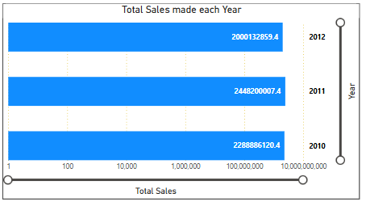

# <h1 id="WalmartWeeklySalesAnalysis20102012">Walmart Weekly Sales Analysis 2010-2012</h1>

# Executive Summary
  This project examines Walmart’s weekly sales data across multiple stores, incorporating economic indicators such as fuel prices, unemployment rates, and the Consumer Price Index (CPI).   The dataset spans several years, offering insights into store performance, seasonal trends, and the influence of economic factors on sales using Microsoft Excel, SQL and Power BI.

# Report Objectives
  The objective of this report is to analyze Walmart’s historical weekly sales performance across multiple stores, integrating economic indicators such as fuel prices, unemployment         rates, and the Consumer Price Index (CPI). This analysis aims to:
- Find which Store made the highest Sales: Check all stores and see which one brought in the most money overall.
- Find the total Weekly Sales for each Store: Add up the sales for each store across all weeks to see how much each store made in total.
- Find the Average Temperature for each Store: Work out the average temperature for each store’s location to see its usual weather.
- What was the Total Sales made each Year: Add up all sales in each year to see how much Walmart made per year.
- Which Week was Fuel Price high and how much was made: Find the week with the most expensive fuel price and check the sales in that same week.
- Show the top 5 highest Weekly sales across all Stores: Pick the 5 weeks where sales were the highest across all stores.
- How much was made in the Week with the highest Inflation in Percentage (%): Look for the week with the highest CPI (inflation) value and see the total sales made in that week.
- Stores with an Average Unemployment rate above 8%: List the stores where the average unemployment rate in their area is more than 8%.
- What are the top 3 Stores that made the most Sales in a Week: Find the top 3 store-week combinations with the biggest sales numbers.
- Find the Average Fuel Price for each Year: Work out the average fuel price for each year to see how it changes over time.

# Data Sources
  The Walmart dataset contains several key data fields, each providing important information for analysis. 
- Store: The Store column identifies each Walmart location by a unique number.
- Date: The Date column shows the start date of the sales week, indicating when the data was recorded.
- Weekly Sales: Weekly Sales ($) represents the total sales made by a store in a specific week, measured in U.S. dollars.
- Holiday Flag: The Holiday Flag indicates whether the week included a major holiday, with a value of 1 representing a holiday week and 0 for a non-holiday week.
- Temperature (℉): Temperature (℉) records the average temperature in the store’s area during the sales week, measured in degrees Fahrenheit.
- Fuel Price: Fuel Price ($) provides the average fuel price in the store’s region for that week, expressed in U.S. dollars per gallon.
- CPI: The CPI (Consumer Price Index) measures the average change over time in the prices of goods and services, serving as an indicator of inflation. A higher CPI reflects higher price    levels compared to a base year.
- Unemployment (%): Unemployment (%) shows the average unemployment rate in the store’s region for the week, indicating the percentage of people without jobs in that area.

# Methodology
  Tools used, 
- Microsoft excel: For Data Cleaning
  The Store Column, Weekly Sales, Fuel Price, Holiday Flag, Temperature, Unemployment were all intact.
  For the Date column, the format was standardized by selecting the Date column, navigating to the ribbon, clicking on “Text to Columns,”   choosing “Delimited,” clicking next, unchecking    all delimiters, clicking next again, selecting “Date” as the column data format, and   finally choosing “Short Date” as the display format.

  The CPI (Consumer Price Index) column, which measures price level changes over time, was converted to a percentage for easier             interpretation. This was done by subtracting the known       base value of 100 from the CPI, making it clearer to see how much prices     have changed relative to the base year.
- SQL: For Data Analysis.
- Power BI: For Data Visualization.

# Reasearch Questions

- Which store made the highest sales?
- Find the total weekly sales for each store?
- Find the average temperature for each store?
- What was the total sales made each year?
- Which week was fuel price high and how much was made?
- Show the top 5 highest weekly sales across all stores?
- How much was made in the week with the highest inflation %?
- Stores with an average unemployment rate above 8%?
- What are the top 3 Stores that made the most Sales in a Week?
- Find the average fuel price for each year?

# Data Analysis / Results 

- A Query to Which Store made the highest Sales.
  
SELECT TOP 1 Store, Date, Weekly_Sales, CPI
FROM [Walmart]
ORDER BY Weekly_Sales DESC;

 

- A Query to find the total weekly sales for each store.
  
SELECT Store, SUM("Weekly_Sales") AS Total_Sales
FROM [Walmart]
GROUP BY Store

 
 
- A Query to Find the average temperature for each store.
  
SELECT Store, AVG("Temperature") AS Avg_Temperature
FROM [Walmart]
GROUP BY Store;

 
- A Query to find Total Sales made each Year.

SELECT  YEAR(date) as YEAR, SUM("Weekly_Sales") AS Total_Sales
FROM [Walmart]
GROUP BY YEAR(date)
ORDER BY Total_Sales DESC

 
 
- A Query to Which week was fuel price high and how much was made.
  
SELECT TOP 1 Date, Weekly_Sales, Fuel_Price 
FROM [Walmart]
ORDER BY Fuel_Price

 
- A Query to Show the top 5 highest weekly sales across all stores.
  
SELECT TOP 5 Store, Date, Weekly_Sales 
FROM [Walmart]
ORDER BY Weekly_Sales DESC

- A Query to show How much was made in the week with the highest inflation in %.

SELECT TOP 1 date, Weekly_Sales, CPI 
FROM [Walmart]
ORDER BY CPI DESC

- A Query to find the Stores with an average unemployment rate above 8%.
  
SELECT Store, AVG("Unemployment") AS Avg_Unemployment
FROM [Walmart]
GROUP BY Store
HAVING AVG("Unemployment") > 8;

- A Query to find the top 3 Stores that made the most Sales in a Week.
  
SELECT TOP 3 Store, Weekly_Sales, Fuel_Price 
FROM [Walmart]
ORDER BY  Weekly_Sales DESC
   

- A Query to Find the average fuel price for each Year.
  
SELECT YEAR(Date) AS Year, AVG("Fuel_Price") AS Avg_Fuel_Price
FROM [Walmart]
GROUP BY YEAR(Date)
ORDER BY Year;

# Findidngs
- The Store with the highest sales is Store 14, achieving $3,818,686.45 in weekly sales on December 24, 2010, with a CPI of 82.54.
- The total weekly sales vary greatly across Walmart stores. Store 4 recorded the highest total weekly sales of $299,543,953.38, followed   closely by Store 13 with $286,517,703.80 and Store 10 with $271,617,713.89. The store with the lowest total weekly sales in the dataset   is Store 42, with $795,657.90.
- From the dataset, Store 33 experienced the highest average temperature at 76.73℉, followed by Store 11 at 72.48℉ and Stores 10 & 42     both at 72.24℉. The coolest average was recorded by Store 7, with 40.01℉.
- From the dataset, the year 2011 recorded the highest total sales at 6,737,218,987.11.
- On February 19, 2010, the fuel price was at a relatively low $2.47 per gallon, during which weekly sales amounted to $47,021.03.
- The highest weekly sales were recorded during the 2010 and 2011 Christmas weeks, with Store 14 leading at $3,818,686.45 on 2010-12-24.    This suggests that holiday periods—especially Christmas—drive peak sales across multiple stores.
- On October 26, 2012, the CPI reached its highest value of 127.23, during which the store generated $549,731.49 in weekly sales. This      indicates that even with higher inflation levels, sales activity still persisted at a significant scale.
- Several stores had an average unemployment rate above 8%. The highest was recorded by Store 12, Store 38, and Store 28, each with         13.12%, indicating they operated in regions with significantly higher unemployment levels compared to others.
- The top three weekly sales across all stores were achieved by Store 14 ($3,818,686.45), Store 20 ($3,766,687.43), and Store 10            ($3,749,057.69). Fuel prices during these peak weeks ranged from $3.14 to $3.24.
- Average fuel prices steadily increased over the three years, rising from $2.82 in 2010 to $3.56 in 2011, and reaching $3.71 in 2012.

# Recommendations
- Since Store 14 recorded the highest weekly sales ($3,818,686.45), Walmart should analyze its operational strategies, customer             demographics, and product mix to replicate this success across other stores.
- Stores like Store 4 ($299,543,953.38) and Store 13 ($286,517,703.80) are top performers annually. Walmart should prioritize inventory,    staffing, and promotional efforts in these high-performing locations to maximize returns.
- Stores in warmer regions (e.g., Store 33 at 76.73°F) may benefit from stocking more seasonal items like summer apparel, beverages, and    outdoor equipment, while colder-region stores could focus on winter gear and heating-related products.
- Sales peaked in 2011 ($2.45B). Walmart should revisit marketing and sales strategies from that year to identify successful campaigns or   economic conditions that could be re-applied today.
- When fuel prices are low ($2.47 on 2010-02-19), sales were relatively small ($47,021.03). Walmart should explore how fuel costs impact    customer spending, potentially offering fuel-linked promotions to stimulate demand.
- When fuel prices are low ($2.47 on 2010-02-19), sales were relatively small ($47,021.03). Walmart should explore how fuel costs impact    customer spending, potentially offering fuel-linked promotions to stimulate demand.
- The top-selling weeks tend to occur around December (holiday period). Walmart should expand holiday marketing, stock popular items        early, and ensure staffing is prepared for high traffic.
- On 2012-10-26, CPI was at 127.23, and sales reached $549,731.49. During high inflation, Walmart should emphasize value pricing, promote   discounts, and increase marketing for essential goods.
- High-unemployment areas (e.g., Store 12 at 13.12%) may require more budget-friendly product ranges, bulk deals, and targeted community    outreach to maintain customer loyalty.
- Stores 14, 20, and 10 are top weekly performers. Walmart should focus competitive intelligence on these locations to understand           pricing, customer service, and promotional tactics that drive their performance.
- Since fuel prices rose from $2.82 in 2010 to $3.71 in 2012, Walmart should monitor transportation costs and their impact on product       pricing. Consider partnerships with fuel providers for customer discounts to maintain foot traffic.

# Possible Limitations
- Incomplete data coverage: The dataset only covers certain years (2010–2012), so trends over a longer period cannot be fully assessed.
- Lack of external economic context: While CPI, fuel prices, and unemployment rates are included, other key factors like population         changes, competitor pricing, or consumer confidence are missing.
- Limited granularity: Weekly sales figures do not break down into product categories, making it harder to pinpoint what specifically       drives high sales in certain weeks or stores.
- Potential inflation effects on sales: Sales are in nominal dollars without adjusting for inflation, so comparisons between years may      overstate actual growth.
- Missing location-specific details: The dataset does not include geographic or demographic information for each store, which limits        understanding of regional differences.
- Incomplete customer behavior insights: No customer footfall data, transaction counts, or basket size information, which makes it hard     to link sales changes to customer volume versus price effects.
- Unbalanced store representation: Some stores have significantly higher or lower total sales, but without data on store size or            capacity, comparisons may be skewed.
- CPI and unemployment data scope: CPI and unemployment appear store-specific, but methodology for linking them to each store is unclear,   potentially affecting accuracy.
- Possible seasonality bias: The top sales weeks mostly occur around the holiday season, but without multiple years of weekly breakdowns,   it’s hard to separate seasonal trends from anomalies.
- No profit or cost data: Sales alone don’t show profitability; a store could have high sales but also high operating costs.

# Conclusion

  The analysis of Walmart’s sales data from 2010 to 2012 reveals that certain stores, notably Store 4, Store 13, and Store 10,            consistently achieved exceptional weekly sales, with peak performance often coinciding with the holiday season. Seasonal patterns,        along with external factors such as CPI, unemployment, and fuel prices, appear to influence sales performance, though not always in a     linear manner.

While overall sales peaked in 2011, growth patterns varied across stores, suggesting that regional economic conditions, local demand,     and store-specific strategies played significant roles. Fuel prices and inflation showed modest correlation with sales fluctuations,      while high unemployment rates did not necessarily suppress store revenue in all cases.

Despite these insights, the dataset’s limited time frame, lack of product-level granularity, and absence of profit metrics constrain      the depth of interpretation. Nonetheless, the results provide valuable guidance for resource allocation, promotional timing, and          economic factor monitoring, which can enhance strategic planning and operational efficiency in retail management.

